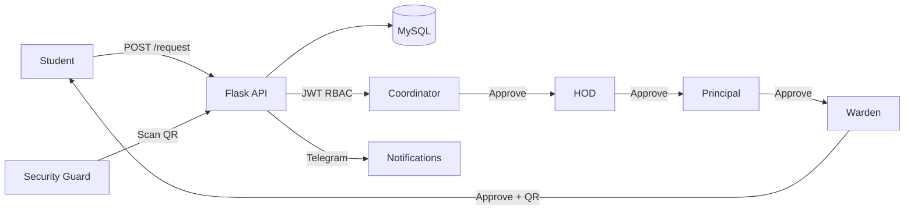

# Hostel Outing Management System — Implementation Plan

A full-stack paperless system for managing hostel outing passes through a multi-tier hierarchical approval workflow (state machine). React frontend, Flask backend, MySQL database.

## Architecture



**State Machine:** `PENDING_COORD → PENDING_HOD → PENDING_PRINCIPAL → PENDING_WARDEN → APPROVED`
Any approver can **REJECT** at their stage.

## Project Structure

```
d:\physicalprobe\myResumeProject1\
├── backend/
│   ├── app.py              # Flask factory + blueprints
│   ├── config.py           # Env-based config
│   ├── models.py           # User + OutingRequest
│   ├── auth.py             # JWT helpers + role_required decorator
│   ├── routes_auth.py      # POST /login, POST /register
│   ├── routes_requests.py  # POST /request, GET /requests/pending, POST /request/<id>/approve|reject
│   ├── routes_scan.py      # POST /scan (Security Guard)
│   ├── notifier.py         # Telegram alerts
│   ├── seed.py             # Seed test users
│   ├── requirements.txt
│   ├── Dockerfile
│   └── .env.example
└── frontend/
    ├── src/
    │   ├── api.js                # Axios + JWT interceptor
    │   ├── context/AuthContext.jsx
    │   ├── pages/
    │   │   ├── LoginPage.jsx
    │   │   ├── StudentDashboard.jsx
    │   │   ├── ApproverDashboard.jsx
    │   │   └── SecurityDashboard.jsx
    │   ├── components/
    │   │   ├── QRModal.jsx
    │   │   └── ProtectedRoute.jsx
    │   └── App.jsx
    ├── package.json
    └── tailwind.config.js
```

---

## Proposed Changes

### Database Layer

#### [NEW] [models.py](file:///d:/physicalprobe/myResumeProject1/backend/models.py)

- **User** model: `id`, `name`, `email`, `password_hash`, `role` (ENUM: STUDENT, COORDINATOR, HOD, PRINCIPAL, WARDEN, SECURITY_GUARD), `telegram_chat_id`
- **OutingRequest** model: `id`, `student_id` (FK), `destination`, `purpose`, `exit_time`, `return_time`, `status` (ENUM state machine), audit timestamps (`coord_approved_at`, `hod_approved_at`, `principal_approved_at`, `warden_approved_at`, `actual_exit_time`, `actual_entry_time`), `qr_code` (unique string generated on final approval)

---

### Backend API

#### [NEW] [auth.py](file:///d:/physicalprobe/myResumeProject1/backend/auth.py)

- `generate_token(user)` — creates JWT with `user_id`, `role`, `exp`
- `decode_token(token)` — validates and returns payload
- `@role_required(*roles)` — decorator that enforces RBAC on endpoints

#### [NEW] [routes_auth.py](file:///d:/physicalprobe/myResumeProject1/backend/routes_auth.py)

- `POST /api/login` — validates credentials, returns JWT
- `POST /api/register` — creates user (for demo/seeding)

#### [NEW] [routes_requests.py](file:///d:/physicalprobe/myResumeProject1/backend/routes_requests.py)

- `POST /api/request` — Student creates outing request (status → PENDING_COORD)
- `GET /api/requests/pending` — Returns requests filtered by caller's role
- `GET /api/requests/my` — Student's own request history
- `POST /api/request/<id>/approve` — Advances state machine, timestamps action, generates QR on final approval, sends Telegram notification to next approver
- `POST /api/request/<id>/reject` — Sets status to REJECTED

#### [NEW] [routes_scan.py](file:///d:/physicalprobe/myResumeProject1/backend/routes_scan.py)

- `POST /api/scan` — Security guard scans QR: records `actual_exit_time` (first scan) or `actual_entry_time` (second scan)

#### [NEW] [notifier.py](file:///d:/physicalprobe/myResumeProject1/backend/notifier.py)

- `send_notification(role, message)` — sends Telegram alert to users with that role

---

### Frontend

#### [NEW] [LoginPage.jsx](file:///d:/physicalprobe/myResumeProject1/frontend/src/pages/LoginPage.jsx)

- Email + password form, calls `/api/login`, stores JWT, routes to role-appropriate dashboard

#### [NEW] [StudentDashboard.jsx](file:///d:/physicalprobe/myResumeProject1/frontend/src/pages/StudentDashboard.jsx)

- Request form (destination, purpose, exit/return time)
- History table with status badges
- QR code modal for APPROVED passes (using `qrcode.react`)

#### [NEW] [ApproverDashboard.jsx](file:///d:/physicalprobe/myResumeProject1/frontend/src/pages/ApproverDashboard.jsx)

- Unified for Coordinator/HOD/Principal/Warden
- Pending requests table filtered by role
- One-click Approve/Reject buttons with confirmation

#### [NEW] [SecurityDashboard.jsx](file:///d:/physicalprobe/myResumeProject1/frontend/src/pages/SecurityDashboard.jsx)

- Mobile-first camera view using `react-qr-reader`
- Scan result display (student info, exit/entry status)

---

### Deployment

#### [NEW] [requirements.txt](file:///d:/physicalprobe/myResumeProject1/backend/requirements.txt)

`flask`, `flask-sqlalchemy`, `flask-cors`, `pymysql`, `PyJWT`, `werkzeug`, `requests`, `python-dotenv`, `gunicorn`, `qrcode`

#### [NEW] [Dockerfile](file:///d:/physicalprobe/myResumeProject1/backend/Dockerfile)

`python:3.11-slim`, installs deps, runs gunicorn

---

## Verification Plan

### Automated
- `py_compile` all Python files
- `npm run build` the frontend

### Manual
> [!IMPORTANT]
> 1. Run `python seed.py` to create demo users for each role
> 2. Start backend: `python app.py`
> 3. Start frontend: `npm run dev`
> 4. Login as each role and test the approval chain
